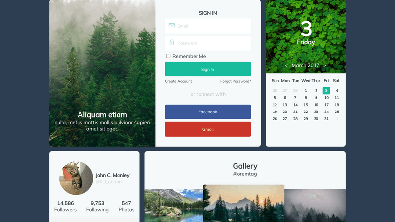

<h3>Hey!</h3>
I'm Skyler, I've been making UI's in industry for 15 years as well as hacking around on personal projects whenever I get a wild idea. I gravitate towards the front end, but as a solo dev on my projects I've had experience with many areas of the stack.

<h3 align="left">Languages and Tools:</h3>

  
  
  
  
  
  
  
  
  
  
  
  
  

<h3 align="left">Looking for an excuse (and time) to learn:</h3>

  
    
  
  

<h3>Previous Work Account</h3>
<a href="https://github.com/skyler-rs" target="_blank" rel="noreferrer">@skyler-rs</a>

<h3>Current Projects</h3>
<table>
  <tr>
    <td>
      <a href="https://www.frameslice.com">FrameSlice.com</a>
    </td>
    <td>
      <a href="https://skylera.github.io/index.html#features">CV Video Processing Pipeline</a>
    </td>
  </tr>
  <tr>
    <td>
      <ul>
        <li>Client side video cropping and labelling site</li>
        <li>Uses ffmpeg.wasm to avoid server uploads</li>
        <li>Next.js / React / Material UI</li>
      </ul>
    </td>
    <td>
      <ul>
        <li>Provides various tools to crop, post process, collect, and label image data for training computer vision models</li>
        <li>Applies computer vision models to video and collects inference results allowing developers to programatically use the results</li>
        <li>Python backend with React frontend</li>
        <li>Private repo for now, but check out some of the features <a href="https://skylera.github.io/index.html#features">here</a></li>
      </ul>
    </td>
  </tr>
</table>

<h3>Frontend Slices</h3>
I'm not very artistic, but I do have a good attention to detail and love slicing existing designs.
You can check some of my work on <a href="https://icodethis.com/SkylerA">iCodeThis

</a>

> Note that there is no hosting on iCodeThis so the source will have some ugly stuff like embedded base64 images etc to avoid linking off the site when possible

<h3>Things I love</h3>

🎵Music, 😻Animals, 🎃Horror Movies, 🎮Video Games, 🏊‍♂️Swimming Laps

💻My Coding Journey

A good portion of my experience and learning has been the result of being fascinated by something and learning whatever tools I needed to explore the topic. When I was a kid I just wanted to show pictures of my favorite LucasArts games so I taught myself HTML. In a highschool typing class, the only game on the computer was a BASIC game where monkeys threw bananas at each other and they exploded. Having little interest in the game itself, I found the source and discovered I could tweak variables to make the explosions fill the screen etc. A bit later in highschool I started teaching myself C++ and then decided to go to Oregon Tech where I got a BS in Software Engineering. There weren't any web courses, but I was always drawn to making pages so I read and fell in love with <em>The Zen of CSS Design</em> and started learning the ancient css styles... anyone remember sliding doors for borders? After college it was a bit of time at Garmin and then most my career making Qt guis for the EDA industry. In my freetime however, I was always teaching myself something new. When the iOS app store arrived, I learned Objective-C and app design to make a hexic clone. After that I spent time learning about AWS services to create an online paper telephone game. A bit later I got obsessed with Madden Ultimate Team and learned PHP so I could create a site that would scrape card data form the EA servers and graph the historic prices of cards etc. After that I got interested in fighting games where I learned a bit of arduino coding so I could solder precisely one bajillion wires onto an xbox controller circuit board so I could electrically read/write inputs to/from the controller to test input timing windows. Now I find myself interested in computer vision working in python and react to create a video processing pipeline to help develop and apply computer vision models to video. In the future I'm hoping I find some excuse to use Rust.

<!--
**SkylerA/skylera** is a ✨ _special_ ✨ repository because its `README.md` (this file) appears on your GitHub profile.

Here are some ideas to get you started:

- 🔭 I’m currently working on ...
- 🌱 I’m currently learning ...
- 👯 I’m looking to collaborate on ...
- 🤔 I’m looking for help with ...
- 💬 Ask me about ...
- 📫 How to reach me: ...
- 😄 Pronouns: ...
- ⚡ Fun fact: ...
-->
